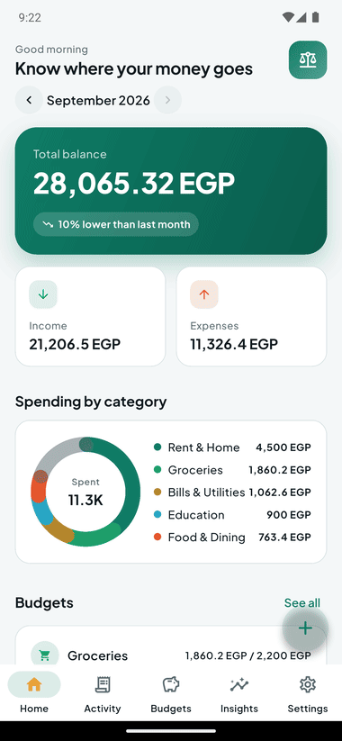
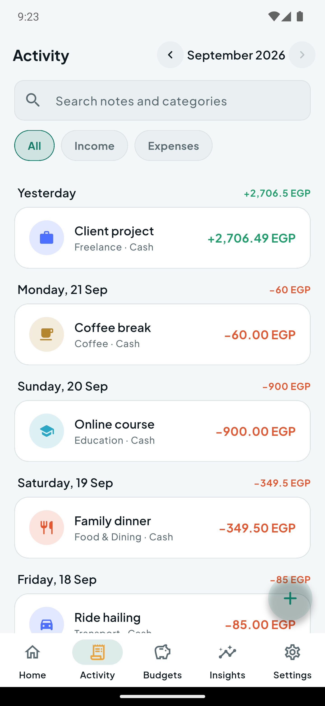
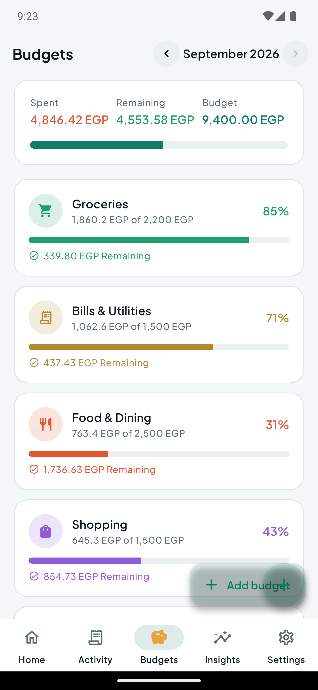
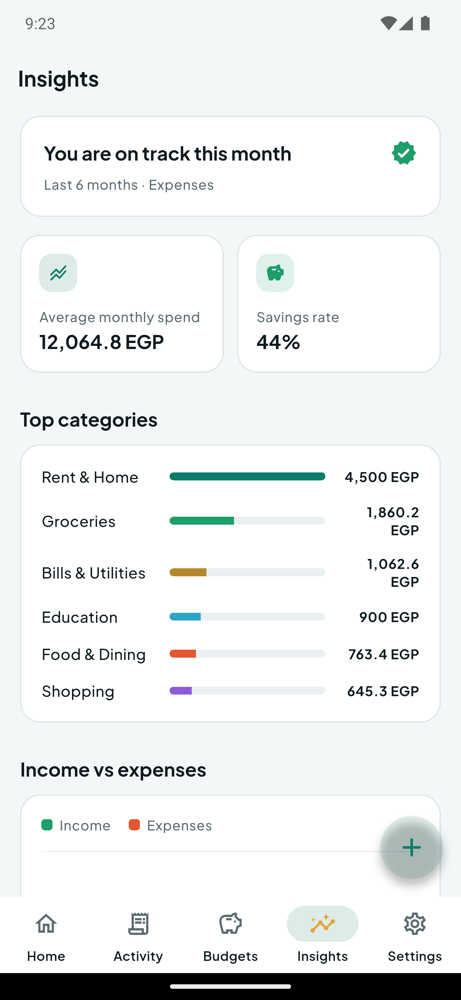
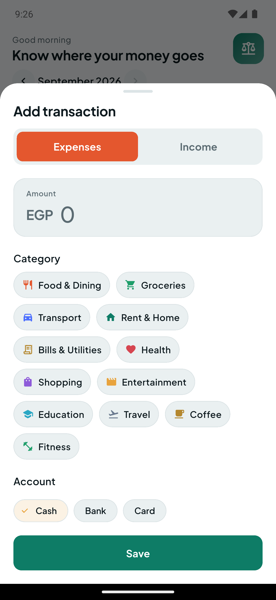
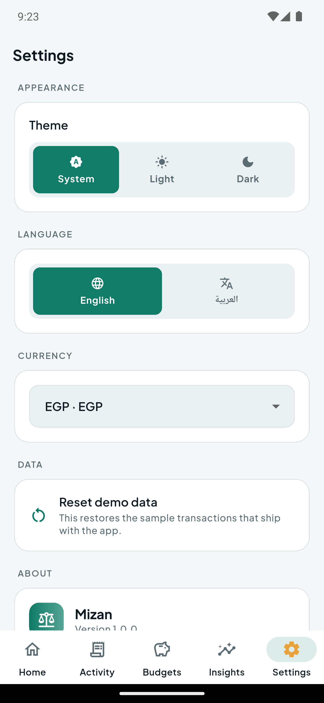
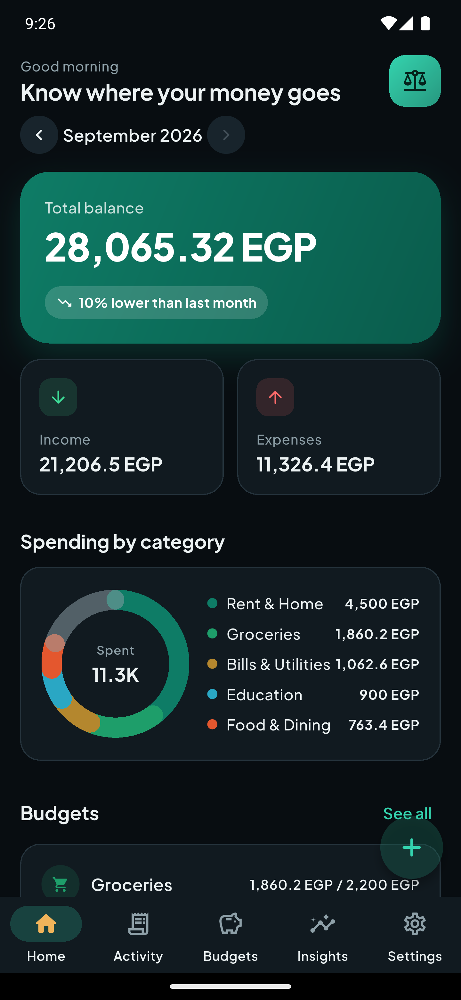
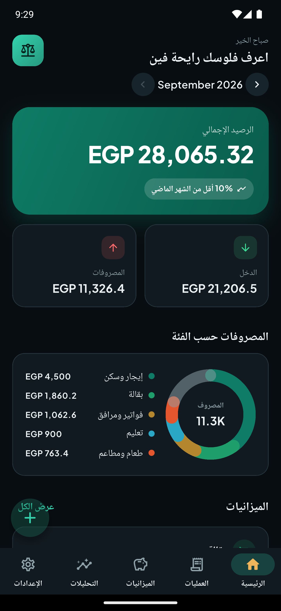
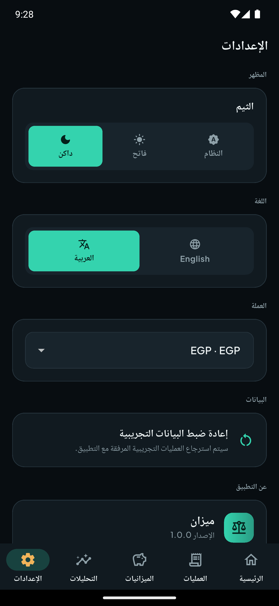

<div align="center">

# Mizan — Personal Finance Tracker

**Know where your money goes.**
An offline-first Flutter app for tracking spending, budgets and monthly insights — with full English and Arabic (RTL) support.

[](https://flutter.dev)
[](https://dart.dev)
[](https://riverpod.dev)
[](LICENSE)
[](https://github.com/MShulkamy/mizan/actions/workflows/ci.yml)



</div>

---

## Why Mizan?

Most budgeting apps want an account, a subscription and your data. **Mizan does none of that.**

- **Offline-first.** Every transaction lives in a local SQLite database on the device.
- **No account, no cloud, no tracking.** Nothing is uploaded anywhere.
- **Bilingual by design.** The whole interface — including layout direction — flips between English and Arabic.
- **Charts without a charting package.** The donut and bar charts are drawn with `CustomPainter`, so the visual language stays consistent and the dependency list stays short.

---

## Screenshots

| Dashboard | Activity | Budgets |
|:-:|:-:|:-:|
|  |  |  |

| Insights | Add transaction | Settings |
|:-:|:-:|:-:|
|  |  |  |

| Dark mode | Arabic (RTL) | Arabic settings |
|:-:|:-:|:-:|
|  |  |  |

---

## Features

### Dashboard
- Total balance, income and expenses for the selected month
- Month-over-month trend, e.g. *"10% lower than last month"*
- Spending breakdown donut chart with a category legend
- Budget progress preview and the latest transactions

### Activity
- Transactions grouped by day with a per-day net total
- Search across notes, plus All / Income / Expenses filters
- Tap any row to edit or delete it

### Budgets
- A monthly limit per category with animated progress bars
- Over-budget state that changes color and shows how far over you are
- A combined summary: spent, remaining and total budget

### Insights
- Average monthly spend and savings rate
- Ranking of the top spending categories
- A six-month income-versus-expenses bar chart

### Adding a transaction
- Expense / income toggle that swaps the available categories
- Large amount field with a numeric keypad
- Category chips, account selection (Cash / Bank / Card), date picker and a note

### Settings
- Theme: System / Light / Dark
- Language: English / العربية
- Currency: EGP, USD, EUR, SAR, AED, GBP
- One-tap restore of the sample data

---

## Architecture

The app is split so that the UI never talks to SQLite directly:

```
lib/
├── main.dart                     # Boots prefs + database, then runs the app
├── app.dart                      # MaterialApp, themes, locale, text scaling
│
├── core/
│   ├── theme/                    # Colors, typography, ThemeData
│   ├── localization/             # English + Arabic string tables
│   └── utils/                    # Currency, number and date formatting
│
├── data/
│   ├── models/                   # Category, MoneyTransaction, Budget, analytics
│   ├── local/app_database.dart   # Schema + starter categories
│   ├── repositories/             # FinanceRepository (abstract) + SQLite impl
│   └── seed/demo_seed.dart       # Deterministic sample data
│
├── state/
│   ├── providers.dart            # Riverpod providers + refresh helper
│   └── settings.dart             # Persisted preferences
│
├── features/
│   ├── shell/                    # Bottom navigation
│   ├── dashboard/ activity/ budgets/ insights/ settings/
│   └── editor/                   # Add / edit transaction sheet
│
└── widgets/                      # Shared cards, tiles, charts, progress bars
```

**Key decisions**

- `FinanceRepository` is an abstract interface, so tests inject an in-memory fake and never touch a real database.
- Analytics queries run in SQL (`GROUP BY substr(date, 1, 7)`), not in Dart — the UI only renders results.
- Icons are stored as string keys that resolve to `const IconData`, which keeps icon tree-shaking working in release builds.

---

## Tech stack

| Concern | Choice |
|---|---|
| State management | `flutter_riverpod` |
| Local database | `sqflite` |
| Preferences | `shared_preferences` |
| Charts | `CustomPainter` (no chart dependency) |
| Formatting | `intl` |
| Localization | `flutter_localizations` + a hand-written string table |
| Font | Plus Jakarta Sans (bundled, so it works offline) |

---

## Getting started

```bash
flutter pub get
flutter run
```

On first launch the app creates the database, seeds 15 categories and fills it with a few months of sample transactions so the charts have something to show. Restore or clear that data any time from **Settings → Reset demo data**.

### Build a release APK

```bash
flutter build apk --release
```

---

## Tests

```bash
flutter analyze
flutter test
```

The suite covers:

- `MonthlySummary` math (balance, savings rate, month-over-month delta)
- `CategorySpend` budget logic (progress clamping, over-budget detection)
- Currency, compact-number and percentage formatting
- A widget smoke test that renders the dashboard and switches tabs using a fake repository

---

## Notes

- The app is portrait-first and adapts its text scale between 0.9× and 1.3× so dense financial rows stay readable.
- Amounts are stored as `REAL` and formatted for display only — no floating-point arithmetic is used for balances beyond simple sums.
- The currency is a display setting; no exchange rates are fetched, so nothing leaves the device.

---

## Author

**Mostafa Sholkamy** — Flutter & Front-End Developer

[](https://mostafa-portfolio.pages.dev)
[](https://www.linkedin.com/in/mostafa-sholkamy-234238390)
[](mailto:mostafasholkamy50@gmail.com)

---

## Related projects

- **[Cloudflare Portfolio](https://github.com/MShulkamy/cloudflare-portfolio)** — a full-stack portfolio site with an admin dashboard on Cloudflare Pages, Functions and D1. [Live demo](https://cloudflare-portfolio-d49.pages.dev).

---

## License

[MIT](LICENSE)
